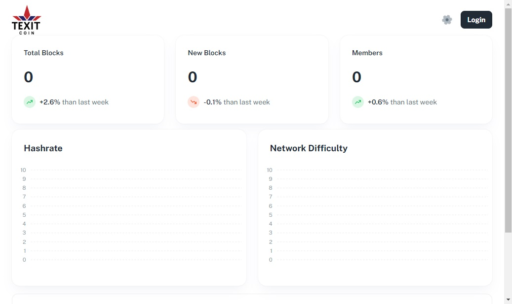

# txt-it-coin-client

TXTIT Coin Crypto client-side app using React + ApexCharts + GraphQL + Vite

## Prerequisites

```yml
Node.js: 16.x || 18.x
```

## Getting Started

```bash
# using Yarn (recommended)
$ yarn install
$ yarn dev
```

```bash
# using NPM
$ npm install
# or
$ npm i --legacy-peer-deps

$ npm run dev
```



&copy; 2024 @codeguru827

All rights reserved.
